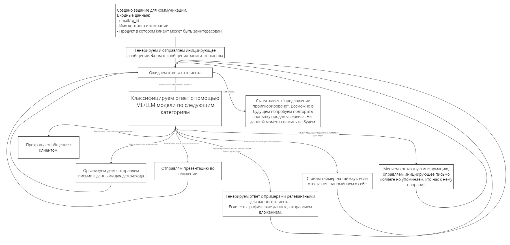
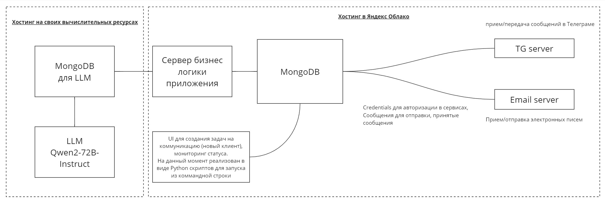

# Проект: Napoleon IT Sales агент для сервиса "Отзывы" 

## Архитектура решения



## Схема работы сервиса



**Система состоит из следующих серверов:**
* MongoDB
* Сервер бизнес логики и аналитики
* Сервер обработки email
* Сервер Telegram-бота

**Коммуникация между серверами осуществляется через MongoDB.** 

Из-за нехватки ресурсов для запуска машины с GPU в Яндекс.Облаке, LLM (Large Language Model) была развернута на собственном сервере. Сервер бизнес-логики и аналитики взаимодействует с LLM через соединение MongoDB, используя публичный IP-адрес.

## О чем клиент может поговорить с Sales агентом?

* Попросить перестать писать
* Запросить презентацию продукта
* Запросить демонстрацию продукта
* Переадресовать агента на другой контакт (консультанта)
* Попросить таймаут в общении (агент напомнит если таймаут вышел, но клиент о нас забыл)
* Рекламировать возможности сервиса Napoleon IT Отзывы

## Комментарий по поводу общения через электронную почту

В текущей реализации, при ответе на письма агента нужно удалять историю общения иначе агент может не точно отвечать.

P.S. Мы знаем как это исправить в будущем релизе.

## Комментарий по поводу общения через Телеграмм

**Телеграм предоставляет два варианта API:**
* API который предоставляет доступ ко всем функциям Телеграмма, которые может совершать пользователь из приложения
* API для телеграмм бота

**Телеграмм бот имеет ограничения**
* Бот не может сам инициировать общение с клиентом. Из-за этого ограничения клиент должен самостоятельно начать общение с ботом, что не подходит для Sales агента.

Мы реализовали доступ к телеграмм через полный API (см. src/services/tg_processor/tg_server), но **Телеграмм заблокировал** наши демонстрационные аккаунты. Поэтому в рамках хакатона мы реализовали альтернативный вариант API для бота (src/services/tg_processor/bot.py).

Из-за этого потенциальному "клиенту" необходимо самостоятельно найти бота по [ссылке](https://t.me/NapaleonIT_Sales_Agent_test_bot)  или @NapoleonIT_Sales_Agent_test_bot и выдать комманду /start.

Для перезапуска общения пользователь всегда может отправить команду /start.

P.S. **В варианте с email каналом коммуникации, система сама отправляет инициирующее сообщение.**

# Как запустить систему?
Каждый сервер системы запускается в собственном Docker контейере. Управдение контейнерами реализовано через docker-compose.

1. Для запуска системы перейдите в папку src/services и выполните: ```docker compose -d up```
2. Для остановки системы: ```docker compose down```
3. Для первоначального старта системы, в БД необходимо записать информацию об email аккаунте и создать .env файл:
4. Запустите контейнеры и убедитесь что Mongo контейнер работает (```docker ps```)
5. Отредактируйте src/services/init_data.json
6. Из папки src/services запустите ```docker run -it -v ./:/my --network=host mail_worker bash``` Откроется консоль в свежезапущенном контейнере
7. ```cd /my && python3 populate_data.py```
8. Отключитесь от контейнер Ctrl-d
9. Для мониторинга системы используются логи в докере: ```docker logs app_logic```

## Как добавить новый контакт, чтобы агент начал общение?
1. Из папки src/services запустите ```docker run -it -v ./:/my --network=host mail_worker bash``` Откроется консоль в свежезапущенном контейнере
2. ```cd /my/app_logic && python3 client_utils.py```

Утилита выдаст Help. С помощью этой утилиты можно создавать новые контакты чтобы сервис начал общение, просматривать текущий статус клиента с историей общения, перезапустить общение с клиентом.
